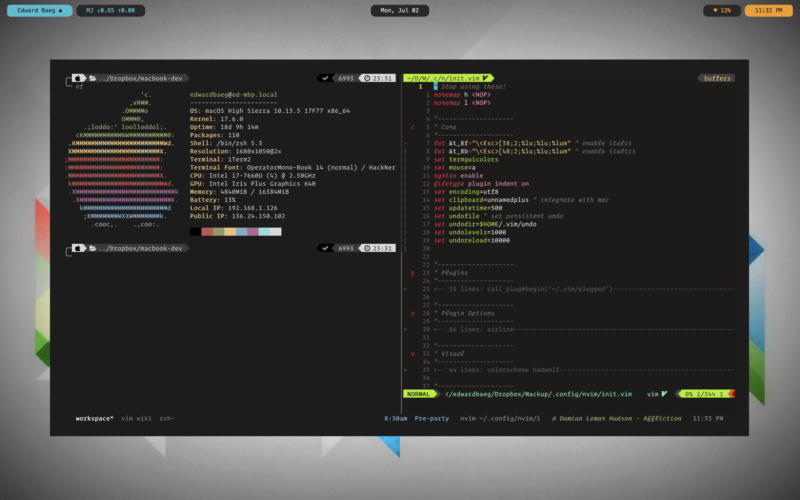

# .dotfiles
This is my development set up! Always a work progress.

## Terminal
**App**: iterm2

**Shell**: zsh

**Framework**: oh-my-zsh

**zsh plugins**:
- `git` lots of git aliases
- `command-not-found` suggest package for failed commands
- `z` autojump, extendible with fzf
- `zsh-users/zsh-syntax-highlighting` syntax highlighting in terminal
- `zsh-users/zsh-autosuggestions` autocomplete based on command history
- `zsh-users/zsh-history-substring-search` cycle through previous commands
- `changyuheng/fz` fzf tab completion with z

**Homebrew formulae** (`brew leaves`):
- `antigen` plugin manager for zsh
- `exa` better ls, can draw directory trees
- `fzf` fuzzy finder
- `highlight` adds syntax highlighting to ranger previews
- `howdoi` search stackexchange
- `neofetch` display system info
- `neovim` better vim (async, community developed)
- `node` for javascript
- `ripgrep` better grep (and faster than ag)
- `rtv` reddit terminal viewer
- `thefuck` quick fix failed commands
- `tmux` terminal multiplexer
- `tty-clock` terminal clock
- `zsh` better shell
- `zsh-completions` command line autocompletions

**npm packages** `(npm -g ls --depth=0)`:
- `eslint` javascript linter
- `git-open` open github repo in browser
- `instant-markdown` live preview markdown with (neo)vim
- `tldr` community written short man pages
- `vtop` visual terminal activity monitor

**pip packages** `(pip list)`
- `mackup` backup MacOS configuration files

**pip2.7 packages** `(pip2.7 list)`
- `gcalcli` view google calendar in calendar

## (neo)vim
**Plugin Manager**: `vim-plug` minimal and super fast with parallel operations

**Plugins**:
- `sjl/badwolf` colorscheme
- `scrooloose/nerdtree` directory tree
- `tpope/vim-airline` lightweight statusbar
- `tpope/vim-surround` adds surround motions
- `jiangmia/auto-pairs` autoclose brackets/quotes
- `airblade/vim-gitgutter` view git changes in gutter
- `tpope/vim-fugitive` git wrapper
- `/usr/local/opt/fzf`, `junegunn/fzf.vim` fuzzy finder
- `w0rp/ale` async linting engine
- `Shougo/deoplete.nvim` async autocompletions
- `tpope/vim-commentary` adds comment motions
- `SirVer/ultisnips` snippet engine
- `honza/vim-snippets` default snippets
- `vimwiki/vimwiki` personal wiki
- `suan/vim-instant-markdown` live prewview markdown
- `ryanoasis/vim-devicons` adds file icons to nerdtree and vim-airline

## .gitconfig
Configured to use `vimdiff` (`nvim -d`) for difftool and mergetool.
