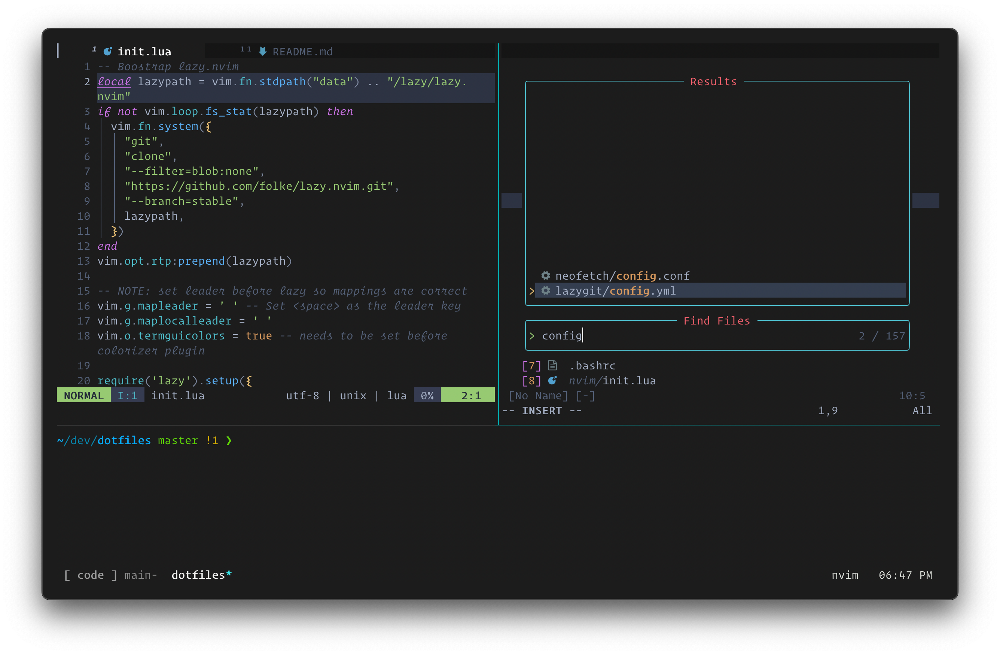

# Dotfiles

My neovim and terminal (Tmux in Kitty) based development setup. Always a work progress!

<!-- TODO: replace with urls instead of assets -->


# Neovim

Configuration: [init.lua](nvim/.config/nvim/init.lua)

Key plugins:
- **Plugin Manager**: lazy.nvim
- **Colorscheme**: onedark/catppuccin
- **Smarts**: Treesitter, LSP, completion, snippets, fuzzy finder
- **Visuals**: statusline, tabline, scrollbar, whichkey, startpage
- **Motions/operators/jump**: textobjects, comments, surrounds, sorting
- **Terminal Integrations**: lazygit, ranger

Set up [below](#neovim-setup).

# Terminal

Application: [Kitty](https://sw.kovidgoyal.net/kitty/)

**Shell + Framework**: `zsh` + `oh-my-zsh`

- autocompletions, vi-mode, syntax highlighting, fzf, z jumping

## Packages

These are mostly brew packages.

<!-- TODO: add a brewfile to run with brew bundle -->

#### Tools

- `bat` better cat (syntax highlighting and pager)
- `eza` better ls
- `fd` better find (fd-find for `apt`)
- `fzf` fuzzy finder
- `ncdu` ncurses disk usage viewer
- `ripgrep` better grep (and faster than ag)
- `stow` symlink manager
- `tlrc` community written short man pages (tlrc is rust client of tldr)
- `zoxide` directory jumper

#### TUI

- `lazygit` git interface
- `nchat` telegram
- `neovim` better vim (async, community developed)
- `ranger` file manager (install with `pip install ranger-fm`)
- `tmux` terminal multiplexer
- `tmuxp` terminal session manager
- `yazi` file manager, seemingly faster than ranger

#### Phone/Android

- `android-platform-tools` (cask)
- `qrcp` qr code generator for wifi transfer
- `scrcpy` android screen mirror/recorder (requires adb)

#### Fun
- `fastfetch` display system info

#### Dependencies

- `git-delta` for git and lazygit, better diff
- `gnu-sed` for nvim, vim-spectre
- `imagemagick` for image rendering with kitty
- `poppler` for yazi, pdf preview
- `unar` for yazi, archive preview
- `zsh-completions` for zsh, command line autocompletions

#### GUI
- `kitty` (cask) terminal emulator
- `emacs` (cask) text editor / environment / operating system

**Terminal Multiplexer**: `tmux`

- Configuration: [tmux.conf](.tmux.conf)
  - keymaps, session keybing toggle

# Setup

Copy over configuration files with `stow`

```
make all
```

## MacOS

Install brew

```
/bin/bash -c "$(curl -fsSL https://raw.githubusercontent.com/Homebrew/install/HEAD/install.sh)"
```

Disable mouse acceleration

```
defaults write .GlobalPreferences com.apple.mouse.scaling -1
```

Enable key repeat

```
defaults write -g ApplePressAndHoldEnabled -bool false
```

- Settings -> Keyboard -> Key repeat rate & Delay until repeat

### Applications:

#### Menubar

- `Bartender`: menubar management
- `Dato`: menubar calendar and meetings
- `Monitor Control`: menubar monitor brightness
- `Stats`: menubar system monitoring

#### Utilities

- `BetterTouchTool`: add shortcuts; 3 finger tap -> middle click
<!-- TODO: replace with browserosaurus, FOSS alternative -->
- `Choosy`: browser launcher
- `Dropover`: drag & drop temporary file shelf
- `Hammerspoon`: mac scripting
- `JankyBorders`: visually highlight focused window (need to start brew service)
- `Karabiner Elements`: remap keys; RShift -> Backspace; Fn -> Fn on external keyboards (maintain for builtin)
- `Mac Mouse Fix`: invert mouse scrolling, fancy remaps, add smooth scrolling
- `Raycast`: launcher
- `Shortcat`: keyboard shortcuts everywhere
- `Shottr`: screenshot tool

## oh-my-zsh

Install zsh framework

```
sh -c "$(curl -fsSL https://raw.githubusercontent.com/robbyrussell/oh-my-zsh/master/tools/install.sh)"
```

Install zsh plugin manager

```
https://github.com/tarjoilija/zgen | git clone https://github.com/tarjoilija/zgen.git "${HOME}/.zgen"
```

Set up fzf

```
$(brew --prefix)/opt/fzf/install
```

## Neovim setup

Install neovim and pynvim (to support python plugins in nvim)

```
brew install neovim
pip3 install --upgrade pynvim
```

Ensure python is working with `:checkhealth`

### Dependencies

- `deno` - for peek.nvim
- `fzf`

## Hammerspoon

Configuration: [init.lua](hammerspoon/init.lua)

- window management, sleep toggle, toggle apps

## Keyboard

Remap Capslock to Control under MacOs settings: Keyboard -> Keyboard Shortcuts -> Modifier Keys

Keyboard layers (0-index), global keyboard bindings are managed through ZSA Oryx firmware, Hammerspoon, and Karabiner Elements

- Symbols, numbers
  - `Layer 1`
- System control, arrow keys
  - `Layer 2` + `,./`: media
  - `shift` + `ctrl` + `,./`: media
  - `Layer 2` + `hjkl`: arrow keys
  - `shift` + `ctrl` + `hjkl`: arrow keys
- Window movement
  - `cmd` + `ctrl` + `hjkl mnbv`: move, resize
  - `cmd` + `ctrl` + `shift` + `hjkl`, change display

## Configure git for github

- Create ssh key for git (press enter for default file location)
- https://docs.github.com/en/authentication/connecting-to-github-with-ssh/generating-a-new-ssh-key-and-adding-it-to-the-ssh-agent

```
ssh-keygen -t rsa -b 4096 -C "youremail@domain.com"
```

- Start ssh-agent in background

```
eval "$(ssh-agent -s)"
```

- Add SSH key

```
ssh-add ~/.ssh/id_rsa
```

- Set config file to automatically load key

```
echo "Host *\n AddKeysToAgent yes\n UseKeychain yes\n IdentityFile ~/.ssh/id_rsa" > ~/.ssh/config
```

- Add key to GH account at https://github.com/settings/keys, using this command to copy key to clipboard:

```
pbcopy < ~/.ssh/id_rsa.pub
```

## Mods

- Spicetify: theme spotify
  - install cli tool, install marketplace, restart app
    ```
    spicetify --config
    spicetify backup apply
    spicetify update
    ```

# RaspberryPi Setup

See detailed instructions in the [raspberrypi directory](raspberrypi/README.md)

- fish (shell) + fisher (plugin manager) + tmux (terminal multiplexer)
